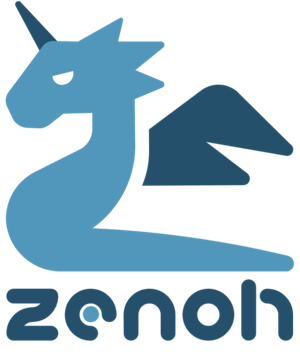

[](https://choosealicense.com/licenses/epl-2.0/)
[](https://opensource.org/licenses/Apache-2.0)

# Zenoh plugin for DDS

## Background
The Data Distribution Service (DDS) is a standard for data-centric publish subscribe. Whilst DDS has been around for quite some time and has a long history of deployments in various industries, it has recently gained quite a bit of attentions thanks to its adoption by the Robotic Operating System (ROS2) -- where it is used for communication between ROS2 nodes.

## Robot Swarms and Edge Robotics
As mentioned above, ROS2 has adopted DDS as the mechanism to exchange data between nodes within and potentially across a robot. That said, due to some of the very core assumptions at the foundations of the DDS wire-protocol, beside the fact that it  leverage UDP/IP multicast for communication,  it is not so straightforward to scale DDS communication over a WAN or across multiple LANs.  Zenoh, on the other hand was designed since its inception to operate at Internet Scale.


Thus, the main motivations to have a **DDS connector** for **zenoh** are:

- Facilitate the interconnection of robot swarms.
- Support use cases of edge robotics.
- Give the possibility to use **zenoh**'s geo-distributed storage and query system to better manage robot's data.

## Architecture
**zenoh** routers provide a plug-in mechanism that allow for extensions to be loaded and activated by its management API. Thus the most natural way to implement a DDS connector for zenoh is to do that as a zenoh router plugin.

This plugin, will essentially:

- Spoof DDS discovery data and transparently expose DDS writers/readers as zenoh publisher/subscribers
- Route the data produced by discovered DDS writers to data to matching entities.
 
Beside the zenoh router plugin we also support a stand-alone bridge called **dzd** that can be used to transparently bridge DDS data on zenoh and viceversa.

### Mapping DDS to zenoh
The mapping between DDS and zenoh is rather straightforward. Given a DDS Reader/Writer for topic ```A``` in a given partition ```P``` with a set of QoS ```Q```, then the equivalent zenoh resource will be named as ```P/A/*```. On the other hand actual writes will be on the resource ```P/A/sample-key-hash``` as this allows for zenoh subscriber to easily subscribe to just a specific Topic instance, a set of them or of all of them.


## Trying it Out
In order to get running with the DDS plugin for zenoh you need first to install the following dependencies:

- [CMake](https://cmake.org/download/)
- Your favourite C/C++ Compiler
- [Rust](https://www.rust-lang.org/tools/install)

Once these dependencies are in place, simply do:

```
$ git clone https://github.com/eclipse-zenoh/zenoh-plugin-dds.git
$ cd zenoh-plugin-dds
$ ./config.sh
$ cargo build --release --all-targets
```

Assuming you want to try this with ROS2, then install it by following the instructions available [here](https://index.ros.org/doc/ros2/Installation/Foxy/).
Once you've installed ROS2, you easily let ROS applications communicate acros the internet. Notice that in order
to really make this work you need to have ROS applications run on different networks. There are different ways of achieving this,
you can use containers, VMs, or hosts on different networks.

In any case assuming you have two networks, let's say N1 and N2, you will need to run one instance of **dzd** per network.
The **dzd** daemon will operate like a transparent router discovering DDS traffic and forwarding it on zenoh w/o you having to
configure anything.

You are also welcome to use the freely available zenoh internet infrastructure to route across the internet, in this case
just start one instance of **dzd** per network by running the following command:

```
$ cargo run -- --scope /demo/dds -e tcp/172.105.86.91:7447
```

The on one of the networks, say N1, start a ROS2 listener by using the following command:
```
$ ros2 run demo_nodes_py listener
```

While on N2 starts a ROS2 talker by using the following command:
```
$ ros2 run demo_nodes_cpp talker
```

You will see a stream of ROS2 *Hello World* messages streamed across the internet!

Good Hacking!
